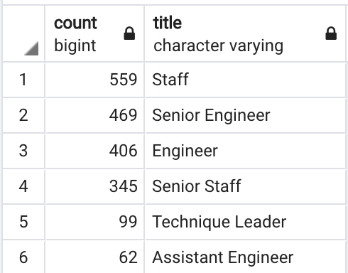

# Pewlett-Hackard-Analysis

# Overview 
Pewlett-Hackard is looking to prepare for the future retirement of a large portion of its staff and would like to prepare for it by analysing the number of job positions will need to be filled in the near future. We are working with a current HR Analyst to determine who will be retiring and how many positions will need to be filled because of this. 

# Purpose 
The purpose of this analysis is to present Pewlett-Hackard with an in-depth analysis of all employees eligible for the retirement package. We will be using ERDS and SQL queries to determine the number of retiring titles per title, as well as identify the employees eligible to participate in the newfound mentorship program. This report will include a summary of the total number of retirees and their titles so that the company can prepare for the future. 

# Analysis 
From the research we have conducted the following assumptions can be made: 
#### Retirement
- It can be determined from the analysis that we have conducted that there is a significantly higher number of employees potentially retiring soon than there are candidates for the mentorship program. Therefore, Pewlett-Hackard will still need to hire additional employees even after conducting the mentorship. 
- Additionally, after analysing the data we can conclude that the title that will be left with the most vacancies is the Engineers, as a total of 31736 employees will be retiring. Closely following is the Senior Staff, of which require a total of 28255 positions to be filled. The position with the least amount of vacancies to be filled is the Managers. 
#####	Mentorship 
- If we are to look at the number of current employee’s eligible for the mentorship program per position the following can be concluded; There will be a total of 559 employees’ “staff” that will be eligible.  Therefore, we will have an influx of staff members that may be needed in another sector such as Assistant Engineering wherein only 62 employees are eligible. 
- Moreover, because the majority of the staff eligible for the mentorship program are all born in the same year and are consequently taking over the current retiring staff members, we can predict that a future “silver tsunami” will also take place and Pewlett-Hackard will have to prepare for it.  

# Further Recommendations 
By employing the COUNT () query in SQL, it is determined that a total of 90,398 positions will need to be filled as the “silver tsunami” begins to make an impact on Pewlett-Hackard. This leaves an extremely large amount of positions vacant and not enough mentees within the company to replace all the retired employees therefore, it is my prerogative that additional hiring will need to be completed in addition to the mentorship program. This can be further evaluated when performing the same COUNT () query on our “mentorship_eligibility” database. The result indicates that only a total of 1,940 employees are eligible for the mentorship program which leaves a considerable amount of vacancies at Pewlett-Hackard that will need to be addressed in an additional manner. Although, there will be enough qualified employees to mentor the eligible staff, this will not be enough to sustain the “silver tsunami”. 

